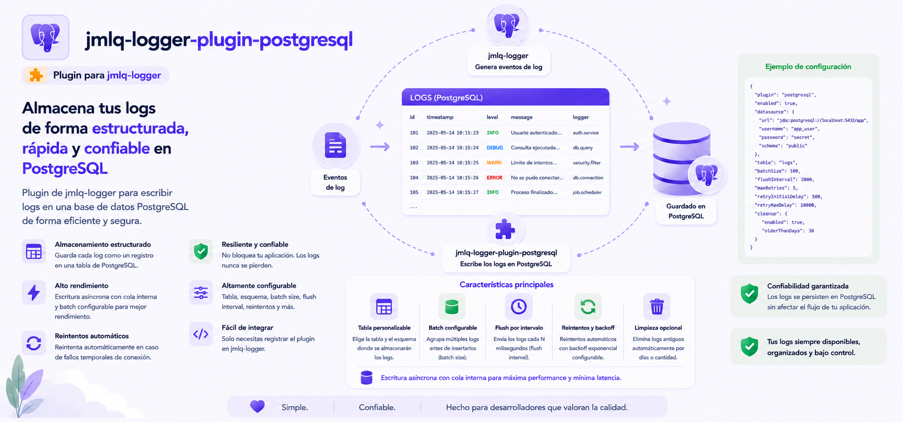

# @jmlq/logger-plugin-postgresql 🐘



Plugin de persistencia para **PostgreSQL** compatible con `@jmlq/logger`.

Este paquete implementa un datasource que cumple el contrato `ILogDatasource` del core, permitiendo:

- Guardar logs en PostgreSQL de forma estructurada
- Consultar logs mediante filtros (si el datasource expone `find`)
- Bootstrap de infraestructura (schema/tabla/índices) cuando está habilitado por configuración
- Retención (poda) de logs antiguos cuando está habilitada por configuración

---

## 🎯 Objetivo

Proveer una implementación PostgreSQL desacoplada (Clean Architecture) para el sistema de logging `@jmlq/logger`, manteniendo el core libre de dependencias directas a `pg`/SQL.

## ⭐ Importancia

PostgreSQL es un destino habitual para logging cuando se necesita:

- escritura fiable y consultable con SQL
- índices bien definidos para auditoría
- control de retención (poda) como tarea operativa

---

## 🏗 Arquitectura (visión rápida)

- **Entrada recomendada:** `createPostgresDatasource(options)`
- El plugin implementa `ILogDatasource` (core) mediante un adapter.
- El acceso a SQL se hace vía el port `ISqlQueryClient` (el host lo implementa; típicamente usando `pg.Pool`).

➡️ [Ver detalle en](./docs/es/architecture.md)

---

## 🔧 Implementación

### 5.1 Instalación

```bash
npm i @jmlq/logger @jmlq/logger-plugin-postgresql pg
```

### 5.2 Dependencias

- `@jmlq/logger` (core)
- `pg` (driver en el host; el plugin opera por medio del port `ISqlQueryClient`)

### 5.3 Uso (crear datasource + conectar con core)

Flujo recomendado:

1. Implementar `ISqlQueryClient` en tu host (adapter del driver `pg`).
2. Crear datasource vía `createPostgresDatasource(options)`.
3. Pasarlo a `createLogger({ datasources: [...] })`.

#### Factory principal (plugin)

```ts
import {
  SaveLogUseCase,
  FindLogsUseCase,
  PruneLogsUseCase,
  EnsureSchemaAndTableUseCase,
} from "../../application/use-cases";

export async function createPostgresDatasource(
  opts: IPostgresDatasourceOptions,
): Promise<ILogDatasource> {
  const schema = opts.schema ?? "public";
  const table = opts.table ?? "logs";

  const repo = new PostgresLogsRepository(opts.client, schema, table);

  if (opts.createIfMissing) {
    const ensure = new EnsureSchemaAndTableUseCase(opts.client, schema, table);
    await ensure.execute();
  }

  const saveLogUseCase = new SaveLogUseCase(repo);
  const findLogsUseCase = new FindLogsUseCase(repo);

  const pruneLogsUseCase = opts.enablePrune
    ? new PruneLogsUseCase(repo)
    : undefined;

  return new PostgresDatasourceAdapter(
    saveLogUseCase,
    findLogsUseCase,
    pruneLogsUseCase,
  );
}
```

➡️ [Más detalle](./docs/es/integration-express.md)

### 5.4 Variables de entorno (.env)

Este plugin **no lee env vars por sí mismo**. Se recomienda leerlas en infraestructura del host:

```ts
const connectionString = process.env.LOGGER_PG_CONNECTION_STRING;
const schema = process.env.LOGGER_PG_SCHEMA;
const table = process.env.LOGGER_PG_TABLE_NAME;
```

➡️ [Ver configuración completa](./docs/es/configuration.md)

### 5.5 Helpers / funcionalidades relevantes

- **Escape de identificadores** (schema/tabla) para evitar SQL injection en nombres:

```ts
export class PostgresLogRowHelper {
  public static normalizeTimestamp(timestamp: PostgresRawTimestamp): number {
    if (timestamp instanceof Date) {
      const ms = timestamp.getTime();
      if (Number.isNaN(ms)) {
        throw new Error("PostgresLogRowHelper: invalid Date timestamp");
      }
      return ms;
    }

    if (typeof timestamp === "number") {
      if (!Number.isFinite(timestamp)) {
        throw new Error("PostgresLogRowHelper: invalid numeric timestamp");
      }
      return timestamp;
    }

    const asNumber = Number(timestamp);
    if (!Number.isNaN(asNumber) && Number.isFinite(asNumber)) {
      return asNumber;
    }

    const asDate = new Date(timestamp);
    const msFromDate = asDate.getTime();
    if (!Number.isNaN(msFromDate)) {
      return msFromDate;
    }

    throw new Error(
      `PostgresLogRowHelper: cannot normalize timestamp value: ${String(
        timestamp,
      )}`,
    );
  }
}
```

---

## ✅ Checklist

- Instalar `@jmlq/logger` + `@jmlq/logger-plugin-postgresql` + `pg`
- Implementar `ISqlQueryClient` (adapter de `pg.Pool`)
- Crear datasource con `createPostgresDatasource(options)`
- Integrar con `createLogger({ datasources: [...] })`
- Configurar schema/tabla/retención/índices (opcional)
- Integrar en Express (`req.logger`) (opcional)

## 🧩 Implementation Example

- [View real integration and documentation](https://github.com/MLahuasi/jmlq-ecosystem/blob/main/doc/es/%40jmlq/logger/postgresql.md)

---

## 📌 Menú

- [Arquitectura](./docs/es/architecture.md)
- [Configuración](./docs/es/configuration.md)
- [Integración Express](./docs/es/integration-express.md)
- [Troubleshooting](./docs/es/troubleshooting.md)

## 🔗 Referencias

- [`@jmlq/logger`](https://github.com/MLahuasi/jmlq-logger/blob/main/README.es.md)
- Plugins relacionados del ecosistema:
  - [`@jmlq/logger-plugin-fs`](https://github.com/MLahuasi/jmlq-logger-plugin-fs/blob/main/README.es.md)
  - [`@jmlq/logger-plugin-mongo`](https://github.com/MLahuasi/jmlq-logger-plugin-mongo/blob/main/README.es.md)

## ⬅️ 🌐 Ecosistema

- [`@jmlq`](https://github.com/MLahuasi/jmlq-ecosystem#readme)
