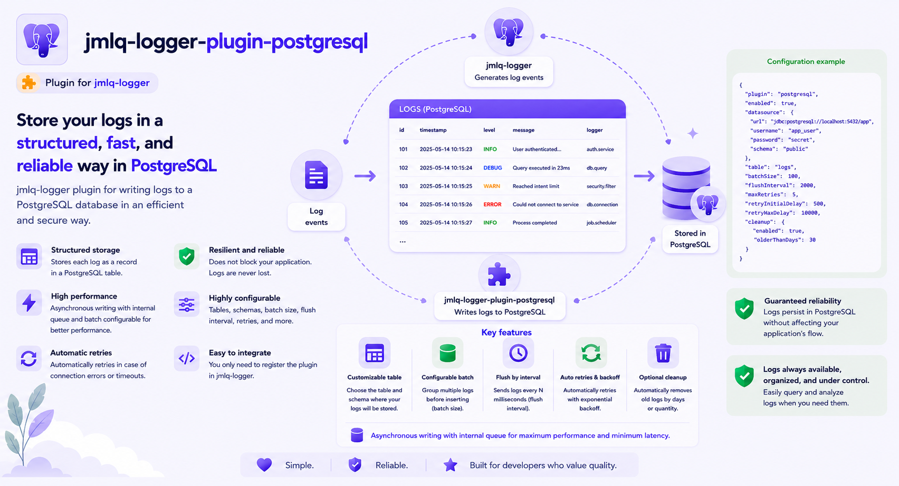

# @jmlq/logger-plugin-postgresql 🐘



Persistence plugin for **PostgreSQL** compatible with `@jmlq/logger`.

This package implements a datasource that fulfills the `ILogDatasource` contract from the core, allowing:

- Store logs in PostgreSQL in a structured way
- Query logs using filters (if the datasource exposes `find`)
- Infrastructure bootstrap (schema/table/indexes) when enabled by configuration
- Retention (pruning) of old logs when enabled by configuration

---

## 🎯 Objective

Provide a decoupled PostgreSQL implementation (Clean Architecture) for the logging system `@jmlq/logger`, keeping the core free from direct dependencies on `pg`/SQL.

## ⭐ Importance

PostgreSQL is a common logging destination when you need:

- reliable and queryable storage using SQL
- well-defined indexes for auditing
- retention control (pruning) as an operational task

---

## 🏗 Architecture (quick view)

- **Recommended entry point:** `createPostgresDatasource(options)`
- The plugin implements `ILogDatasource` (core) through an adapter.
- SQL access is done via the `ISqlQueryClient` port (implemented by the host, typically using `pg.Pool`).

➡️ [See details in](./docs/en/architecture.md)

---

## 🔧 Implementation

### 5.1 Installation

```bash
    npm i @jmlq/logger @jmlq/logger-plugin-postgresql pg
```

### 5.2 Dependencies

- `@jmlq/logger` (core)
- `pg` (driver in the host; the plugin works through the `ISqlQueryClient` port)

### 5.3 Usage (create datasource + connect with core)

Recommended flow:

1. Implement `ISqlQueryClient` in your host (adapter for the `pg` driver)
2. Create datasource via `createPostgresDatasource(options)`
3. Pass it to `createLogger({ datasources: [...] })`

#### Main factory (plugin)

```ts
import {
  SaveLogUseCase,
  FindLogsUseCase,
  PruneLogsUseCase,
  EnsureSchemaAndTableUseCase,
} from "../../application/use-cases";

export async function createPostgresDatasource(
  opts: IPostgresDatasourceOptions,
): Promise<ILogDatasource> {
  const schema = opts.schema ?? "public";
  const table = opts.table ?? "logs";

  const repo = new PostgresLogsRepository(opts.client, schema, table);

  if (opts.createIfMissing) {
    const ensure = new EnsureSchemaAndTableUseCase(opts.client, schema, table);
    await ensure.execute();
  }

  const saveLogUseCase = new SaveLogUseCase(repo);
  const findLogsUseCase = new FindLogsUseCase(repo);

  const pruneLogsUseCase = opts.enablePrune
    ? new PruneLogsUseCase(repo)
    : undefined;

  return new PostgresDatasourceAdapter(
    saveLogUseCase,
    findLogsUseCase,
    pruneLogsUseCase,
  );
}
```

➡️ [More details](./docs/en/integration-express.md)

### 5.4 Environment variables (.env)

This plugin **does not read env vars by itself**. It is recommended to read them in the host infrastructure:

```ts
const connectionString = process.env.LOGGER_PG_CONNECTION_STRING;
const schema = process.env.LOGGER_PG_SCHEMA;
const table = process.env.LOGGER_PG_TABLE_NAME;
```

➡️ [Full configuration](./docs/en/configuration.md)

### 5.5 Helpers / key features

- Identifier escaping (schema/table) to prevent SQL injection in names

- Row normalization helper (PostgreSQL → LogRecord):

```ts
export class PostgresLogRowHelper {
  public static normalizeTimestamp(timestamp: PostgresRawTimestamp): number {
    if (timestamp instanceof Date) {
      const ms = timestamp.getTime();
      if (Number.isNaN(ms)) {
        throw new Error("PostgresLogRowHelper: invalid Date timestamp");
      }
      return ms;
    }

    if (typeof timestamp === "number") {
      if (!Number.isFinite(timestamp)) {
        throw new Error("PostgresLogRowHelper: invalid numeric timestamp");
      }
      return timestamp;
    }

    const asNumber = Number(timestamp);
    if (!Number.isNaN(asNumber) && Number.isFinite(asNumber)) {
      return asNumber;
    }

    const asDate = new Date(timestamp);
    const msFromDate = asDate.getTime();
    if (!Number.isNaN(msFromDate)) {
      return msFromDate;
    }

    throw new Error(
      `PostgresLogRowHelper: cannot normalize timestamp value: ${String(
        timestamp,
      )}`,
    );
  }
}
```

---

## ✅ Checklist

- Install `@jmlq/logger` + `@jmlq/logger-plugin-postgresql` + `pg`
- Implement `ISqlQueryClient` (adapter for `pg.Pool`)
- Create datasource with `createPostgresDatasource(options)`
- Integrate with `createLogger({ datasources: [...] })`
- Configure schema/table/retention/indexes (optional)
- Integrate into Express (`req.logger`) (optional)

## 🧩 Implementation Example

- [View real integration and documentation](https://github.com/MLahuasi/jmlq-ecosystem/blob/main/doc/en/%40jmlq/logger/postgresql.md)

---

## 📌 Menu

- [Architecture](./docs/en/architecture.md)
- [Configuration](./docs/en/configuration.md)
- [Express Integration](./docs/en/integration-express.md)
- [Troubleshooting](./docs/en/troubleshooting.md)

## 🔗 References

- [`@jmlq/logger`](https://github.com/MLahuasi/jmlq-logger#readme)
- Related ecosystem plugins:
  - [`@jmlq/logger-plugin-fs`](https://github.com/MLahuasi/jmlq-logger-plugin-fs#readme)
  - [`@jmlq/logger-plugin-mongo`](https://github.com/MLahuasi/jmlq-logger-plugin-mongo#readme)

## ⬅️ 🌐 Ecosystem

- [`@jmlq`](https://github.com/MLahuasi/jmlq-ecosystem#readme)
