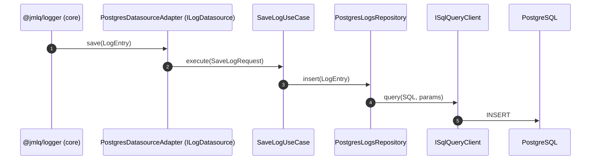
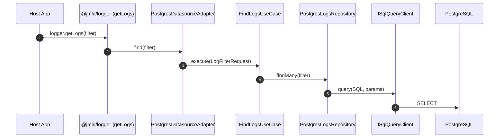
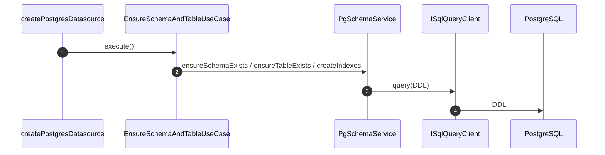

# @jmlq/logger-plugin-postgresql — Architecture 🏛️

## 🎯 Objetivo

Documentar la arquitectura real del plugin PostgreSQL para `@jmlq/logger`, mostrando:

- Capas (Domain / Application / Infrastructure)
- Contratos (ports) y responsabilidades
- Flujo de escritura/lectura, y bootstrap de schema/tabla cuando aplica

---

## 🧩 Clean Architecture (dirección de dependencias)

```text
Domain ← Application ← Infrastructure
```

---

## 🧱 Capas y componentes

### 1) Domain

- Contratos (ports):
  - `ISqlQueryClient` (ejecución SQL de bajo nivel)
  - `IPostgresLogsRepositoryPort` (operaciones CRUD/consulta/poda)
  - `ILogDatasource` (re-export del core)
- Requests/Responses:
  - filtro de logs (nivel, query, since/until)
  - respuesta tipada de logs

#### Port principal: `ISqlQueryClient`

```ts
export interface ISqlQueryResult<T = any> {
  rows: T[];
  rowCount?: number;
}

export interface ISqlQueryClient {
  query<T = any>(
    text: string,
    params?: ReadonlyArray<any>,
  ): Promise<ISqlQueryResult<T>>;
}
```

#### Requests

```ts
export interface LogFilterRequest {
  levelMin?: LogLevel;
  since?: number;
  until?: number;
  limit?: number;
  offset?: number;
  query?: string;
}

export interface SaveLogRequest {
  log: LogEntry;
}
```

#### Response

```ts
export interface ILogResponse {
  source: string;
  level: LogLevel;
  message: string | Record<string, unknown>;
  meta?: unknown;
  timestamp: number;
}
```

#### Value Object

```ts
export enum LogLevel {
  TRACE = 10,
  DEBUG = 20,
  INFO = 30,
  WARN = 40,
  ERROR = 50,
  FATAL = 60,
}
```

---

### 2) Application

- Use cases (típicos según implementación):
  - `EnsureSchemaAndTableUseCase` (bootstrap de schema/tabla)
  - `SaveLogUseCase`
  - `FindLogsUseCase`
  - `PruneLogsUseCase` (retención/poda)
- Factory:
  - `createPostgresDatasource(options)`

#### Factory (composition root)

```ts
export async function createPostgresDatasource(
  opts: IPostgresDatasourceOptions,
): Promise<ILogDatasource> {
  const schema = opts.schema ?? "public";
  const table = opts.table ?? "logs";

  const repo = new PostgresLogsRepository(opts.client, schema, table);

  if (opts.createIfMissing) {
    const ensure = new EnsureSchemaAndTableUseCase(opts.client, schema, table);
    await ensure.execute();
  }

  const saveLogUseCase = new SaveLogUseCase(repo);
  const findLogsUseCase = new FindLogsUseCase(repo);

  const pruneLogsUseCase = opts.enablePrune
    ? new PruneLogsUseCase(repo)
    : undefined;

  return new PostgresDatasourceAdapter(
    saveLogUseCase,
    findLogsUseCase,
    pruneLogsUseCase,
  );
}
```

---

### 3) Infrastructure

- Adapter datasource compatible con el core (`ILogDatasource`).
- Repository PostgreSQL.
- Service DDL (schema/tabla/índices).

#### Adapter: PostgresDatasourceAdapter

#### Adapter: PostgresDatasourceAdapter

```ts
export class PostgresDatasourceAdapter implements ILogDatasource {
  readonly name = "postgres";

  constructor(
    private readonly saveLogUseCase: SaveLogUseCase,
    private readonly findLogsUseCase: FindLogsUseCase,
    private readonly pruneLogsUseCase?: PruneLogsUseCase,
  ) {}

  async save(log: CoreLogEntry): Promise<void> {
    const dto: SaveLogRequest = { log };
    await this.saveLogUseCase.execute(dto);
  }

  async find(filter?: LogSearchRequest): Promise<LogRecord[]> {
    const domainFilter = (filter ?? {}) as any;
    const result = await this.findLogsUseCase.execute(domainFilter);
    return result as any;
  }

  async flush(): Promise<void> {
    // noop
  }

  async dispose(): Promise<void> {
    // noop
  }

  async pruneOlderThan(days: number): Promise<number> {
    if (!this.pruneLogsUseCase) return 0;
    return this.pruneLogsUseCase.execute({ days });
  }
}
```

#### Schema service

```ts
export async function ensurePostgresSchemaAndTable(
  client: ISqlQueryClient,
  schema: string,
  table: string,
): Promise<void> {
  await client.query(`CREATE SCHEMA IF NOT EXISTS ${quoteIdent(schema)};`);

  const fq = `${quoteIdent(schema)}.${quoteIdent(table)}`;

  await client.query(`
        CREATE TABLE IF NOT EXISTS ${fq} (
          source   TEXT   NULL,
          timestamp BIGINT NOT NULL,
          level     INT    NOT NULL,
          message   TEXT   NOT NULL,
          meta      JSONB
        );

        CREATE INDEX IF NOT EXISTS ${quoteIdent(
          `idx_${table}_ts`,
        )} ON ${fq}(timestamp);

        CREATE INDEX IF NOT EXISTS ${quoteIdent(
          `idx_${table}_level_ts`,
        )} ON ${fq}(level, timestamp);
      `);
}

export async function pruneLogsOlderThan(
  client: ISqlQueryClient,
  schema: string,
  table: string,
  days: number,
): Promise<number> {
  const fq = `${quoteIdent(schema)}.${quoteIdent(table)}`;
  const cutoff = Date.now() - days * 24 * 60 * 60 * 1000;

  const res = await client.query<{ ok: number }>(
    `DELETE FROM ${fq} WHERE timestamp < $1 RETURNING 1 as ok`,
    [cutoff],
  );

  return res.rows.length;
}
```

---

## 🔁 Flujos

### Escritura (save)



### Lectura (find)



### Bootstrap (schema/tabla/índices) cuando aplica



---

## 🔗 Referencias

## ⬅️ Anterior

- [`inicio`](../../README.es.md)

## ➡️ Siguiente

- [Configuración](./configuration.md)
- [Integración Express](./integration-express.md)
- [Troubleshooting](./troubleshooting.md)
